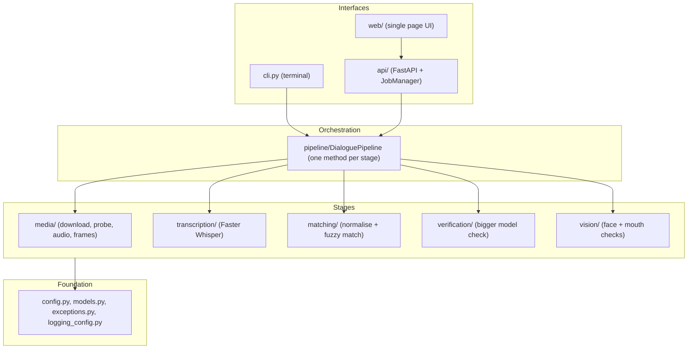
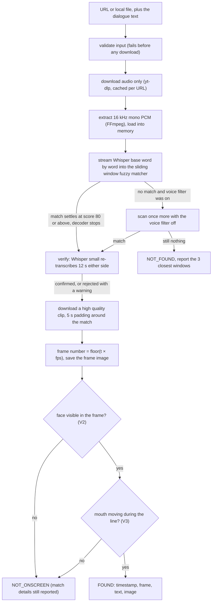
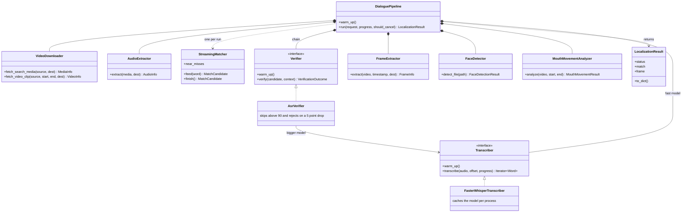

# 2. Architecture

## Layers

Three interfaces drive one framework-free pipeline; the pipeline is a straight line of small
stages that talk to each other only through the shared dataclasses in `models.py`.



Rules that keep the layers honest:

1. **Stages never import each other's implementations** — they exchange the dataclasses in
   `models.py`. The matcher does not know Whisper exists; the verifier only sees a
   `Transcriber` interface.
2. **Configuration is injected.** Each stage receives its own config sub-object
   (`DownloadConfig`, `MatchingConfig`, …) in its constructor. Nothing calls `get_settings()`
   except the interface layer.
3. **The pipeline knows nothing about HTTP or HTML.** It reports progress through a plain
   callback and returns a `LocalizationResult`. The CLI prints it; the API serialises it.
4. **Errors cross boundaries as `DialogueLocatorError` subclasses** that carry a `stage`, so
   every interface can say *where* something failed without inspecting types.

## Data flow



Concrete types at each arrow (all in `models.py`):

| From → To | Type | Notes |
|---|---|---|
| download → audio | `MediaInfo` | the cheap search download; may have no video stream |
| audio → transcription | `AudioInfo` + `np.ndarray` | 16 kHz mono float32 loaded once, shared with the verifier |
| transcription → matching | `Iterator[Word]` | absolute timestamps; consumer may stop the generator |
| matching → verification | `MatchCandidate` | score, start/end, matched text, word indices |
| verification → download_video | `MatchCandidate` (possibly `refined`) | plus `VerificationOutcome` per verifier |
| download_video → frame | `VideoInfo` | a full-quality clip; `clip_start` maps source time → clip time |
| frame → face_detection | `FrameInfo` | frame number, exact frame time, image path |
| face_detection → mouth_movement | `FaceDetectionResult` | mouth check only runs on a confirmed face |
| mouth_movement → result | `MouthMovementResult` | `moving` may be None (indeterminate → fail open) |

## Class diagram

The important classes and how they relate. The two interfaces (`Transcriber` and `Verifier`)
are the seams: swap the implementation and nothing else changes, which is also how the tests
inject fakes.



## Stage timeline of a typical job

```
input           0.0 s   validate; fails before any I/O
download        1–60 s  audio-first search fetch; cached per source URL (sha1) under data/work/<key>/
audio           1–5 s   ffmpeg → audio.wav (cached with the media)
transcription   N×      streams until first match; progress = position in audio; VAD-off retry on a miss
matching        0       folded into transcription (scored per word)
verification    5–60 s  larger model on ±12 s; skipped ≥ 90; refines or warns
download_video  2–30 s  a few seconds of full-quality clip around the verified match
frame           0.1 s   OpenCV seek + JPEG write
face_detection  0.1 s   BlazeFace on the saved frame (V2); gates the verdict, fails open
mouth_movement  1–5 s   Face Landmarker over the window's frames (V3); gates, fails open
```

`LocalizationResult.stage_timings` records each of these plus `total`.

## Extension points (designed in, not bolted on)

| Want to… | Do this | Touches |
|---|---|---|
| Add another visual validation stage (V4+) | follow the V2/V3 pattern: analyser class in `vision/`, `_stage_*` method, config toggle | vision/, pipeline, config |
| Add another audio confirmation check | subclass `verification.base.Verifier`, append to `build_default_verifiers` | verification/, pipeline (1 line) |
| Swap ASR engine | subclass `transcription.base.Transcriber` | transcription/, pipeline (constructor) |
| Try another fuzzy scorer | pass `scorer=` to `StreamingMatcher` / `best_match` | nothing else |
| Persist jobs in Redis/DB | replace `api/jobs.py` | api/ only |

See [Extending](08-extending.md) for worked examples.

## Process & threading model

* CLI: single process, single thread, synchronous.
* Server: uvicorn (async) + `JobManager` thread pool (`max_concurrent_jobs`, default 1).
  Whisper models are loaded once per process in `WhisperModelCache` (thread-safe) and shared.
  Warm-up runs in a daemon thread at startup so the UI is reachable immediately.
* Cancellation is cooperative: the pipeline polls `should_cancel()` per word and per stage.
