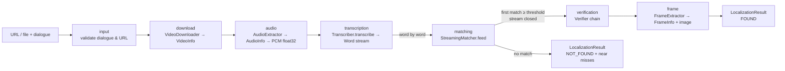

# 2. Architecture

## Layers

```
┌──────────────────────────────────────────────────────────────────────────┐
│ Interfaces        cli.py            api/ (FastAPI)          web/ (HTML/JS) │
├──────────────────────────────────────────────────────────────────────────┤
│ Orchestration     pipeline/pipeline.py  — DialoguePipeline, PipelineRequest │
├──────────────────────────────────────────────────────────────────────────┤
│ Stages            media/            transcription/   matching/   verification/ │
│                   probe, downloader base, faster_    normalize,  base, asr_    │
│                   audio, frames     whisper          matcher     verifier      │
├──────────────────────────────────────────────────────────────────────────┤
│ Foundation        config.py   models.py   exceptions.py   logging_config.py │
└──────────────────────────────────────────────────────────────────────────┘
```

Rules that keep the layers honest:

1. **Stages never import each other's implementations** — they exchange the dataclasses in
   `models.py`. The matcher does not know Whisper exists; the verifier only sees a
   `Transcriber` interface.
2. **Configuration is injected.** Each stage receives its own config sub-object
   (`DownloadConfig`, `MatchingConfig`, …) in its constructor. Nothing calls `get_settings()`
   except the interface layer.
3. **The pipeline knows nothing about HTTP or HTML.** It reports progress through a plain
   callback and returns a `LocalizationResult`. The CLI prints it; the API serialises it.
4. **Errors cross boundaries as `DialogueLocatorError` subclasses** that carry a `stage`, so
   every interface can say *where* something failed without inspecting types.

## Data flow



Concrete types at each arrow (all in `models.py`):

| From → To | Type | Notes |
|---|---|---|
| download → audio | `VideoInfo` | local path + ffprobe facts (fps, duration, frame_count) |
| audio → transcription | `AudioInfo` + `np.ndarray` | 16 kHz mono float32 loaded once, shared with the verifier |
| transcription → matching | `Iterator[Word]` | absolute timestamps; consumer may stop the generator |
| matching → verification | `MatchCandidate` | score, start/end, matched text, word indices |
| verification → frame | `MatchCandidate` (possibly `refined`) | plus `VerificationOutcome` per verifier |
| frame → result | `FrameInfo` | frame number, exact frame time, image path |

## Stage timeline of a typical job

```
input          0.0 s   validate; fails before any I/O
download       1–200 s cached per source URL (sha1) under data/work/<key>/
audio          1–5 s   ffmpeg → audio.wav (cached with the video)
transcription  N×      streams until first match; progress = position in audio
matching       0       folded into transcription (scored per word)
verification   30–60 s large model on ±20 s; refines or warns
frame          0.1 s   OpenCV seek + JPEG write
```

`LocalizationResult.stage_timings` records each of these plus `total`.

## Extension points (designed in, not bolted on)

| Want to… | Do this | Touches |
|---|---|---|
| Add V2 "speaker on camera" check | subclass `verification.base.Verifier`, append to `build_default_verifiers` | verification/, pipeline (1 line) |
| Swap ASR engine | subclass `transcription.base.Transcriber` | transcription/, pipeline (constructor) |
| Try another fuzzy scorer | pass `scorer=` to `StreamingMatcher` / `best_match` | nothing else |
| Persist jobs in Redis/DB | replace `api/jobs.py` | api/ only |
| Fetch audio-only first (see decision log) | change `VideoDownloader`, add a second fetch before `frame` | media/, pipeline |

See [Extending](08-extending.md) for worked examples.

## Process & threading model

* CLI: single process, single thread, synchronous.
* Server: uvicorn (async) + `JobManager` thread pool (`max_concurrent_jobs`, default 1).
  Whisper models are loaded once per process in `WhisperModelCache` (thread-safe) and shared.
  Warm-up runs in a daemon thread at startup so the UI is reachable immediately.
* Cancellation is cooperative: the pipeline polls `should_cancel()` per word and per stage.
